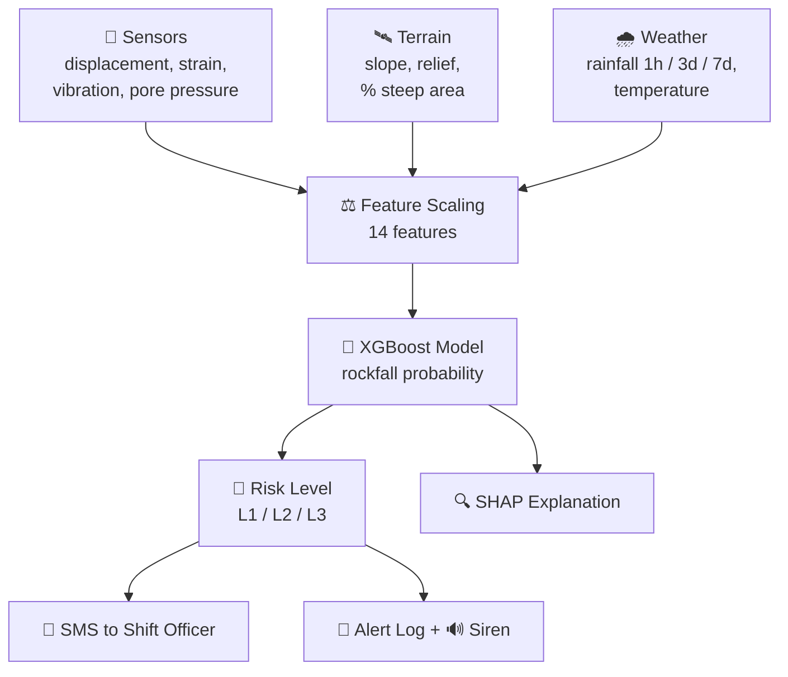
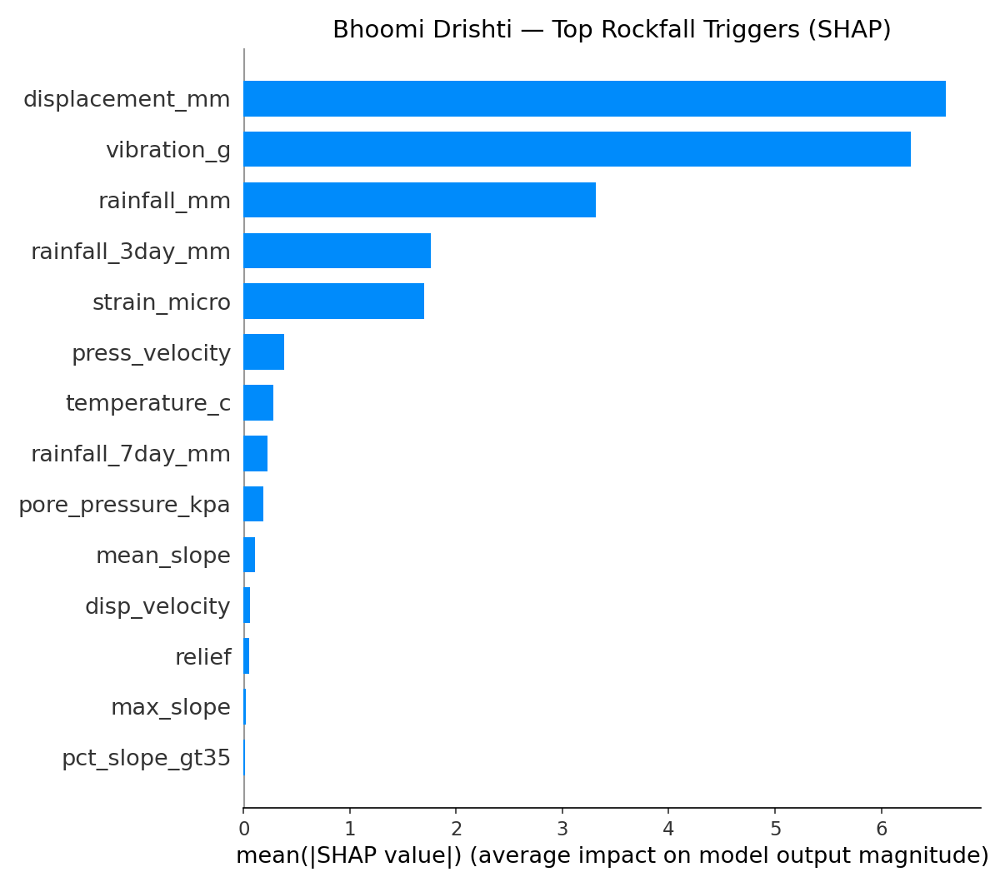

# ⛏️ PRAHARI — Mine Safety AI System

### Predictive Rockfall Early-Warning for Indian Mines


> 🛡️ **Har Kaan Surakshit — Every Mine Safe**
>
> PRAHARI predicts rockfalls **24–72 hours in advance**, instead of raising an alarm when it is already too late.

---

## 🚨 The Problem

Rockfalls and slope failures are among the deadliest hazards in open-cast mining. Traditional slope-stability radars are **reactive**: they alarm only after displacement crosses a fixed threshold, often when the failure has already started. Workers and heavy machinery get little or no time to evacuate.

| Traditional Radar | PRAHARI |
|---|---|
| ⏰ "It is happening **now**" | 🔮 "It will happen **soon**, move now" |
| Single-threshold alarm | Multi-parameter pattern learning |
| No explanation | Explainable with SHAP |
| Manual communication | Automatic SMS + siren |

---

## 💡 Our Solution

**PRAHARI** (*Sanskrit for "Sentinel"*) is an AI dashboard that combines **geotechnical sensor data**, **rainfall history** and **terrain features** to learn how a slope deteriorates before it fails (creep → acceleration → collapse).

When risk turns critical, it acts on its own: it recommends DGMS-aligned actions, sounds an alarm, and **sends an emergency SMS** to the shift officer.

---

## ✨ Features

- 🤖 **Predictive AI engine** — XGBoost model using 14 sensor, weather and terrain features
- 📡 **Autonomous sensor feed** — readings refresh every 30 seconds (simulated, designed for real IoT/MQTT hardware)
- 🎛️ **Scenario mode** — "What if it rains 40 mm/hr?" What-if testing with stress and rainfall sliders
- 🗺️ **Satellite risk map** — colour-coded zone risk on Esri satellite imagery
- 📈 **72-hour risk forecast** — how risk evolves over the next three days
- 🕐 **PRAHARI vs Traditional Radar** — timeline showing how many hours earlier PRAHARI warns
- 🔍 **Explainable AI** — SHAP shows *why* a zone is risky
- 🚦 **4-level alert system** — Normal, L1, L2, L3 with automatic action plans
- 📱 **Real SMS alerts** — Twilio sends evacuation orders to the shift officer
- 🔊 **Siren and pop-up alerts** during critical conditions
- 🔔 **Alert log** for every shift
- 🔐 **Secure login** with DGMS ID and passcode
- 🌧️ **Monsoon-aware** rainfall baselines (June to September)

---

## 🧠 How It Works



### 📐 Input Features

| Category | Features |
|---|---|
| 🪨 Slope movement | `displacement_mm`, `disp_velocity`, `strain_micro` |
| 💧 Hydrology | `pore_pressure_kpa`, `press_velocity` |
| 📳 Dynamics | `vibration_g` |
| 🌧️ Weather | `rainfall_mm`, `rainfall_3day_mm`, `rainfall_7day_mm`, `temperature_c` |
| 🏔️ Terrain | `mean_slope`, `max_slope`, `relief`, `pct_slope_gt35` |

### ⏱️ Early-Warning Timeline

| Phase | Time to failure | Traditional Radar | PRAHARI |
|---|---|---|---|
| 🟢 Normal | more than 48 h | Silent | Silent |
| 🟡 Primary creep | 48 to 24 h | Silent | 👁️ Detects pattern change |
| 🟠 Secondary creep | 24 to 6 h | Silent | ⚠️ Raises alert |
| 🔴 Tertiary creep | less than 6 h | 🚨 Fires (too late) | ⛔ Evacuation already underway |

---

## 🔍 Explainable AI (SHAP)

Mine managers will only act on a prediction they can trust, so PRAHARI shows which factors drive each risk score.



**Key insights:**

1. 🥇 **Displacement** and 🥈 **vibration** are the strongest predictors
2. 🌧️ **Rainfall** (current and 3-day total) is the top environmental trigger
3. 📏 **Strain** is the fifth most important signal
4. 🏔️ Static terrain features matter less once live sensor data is available

---

## 🚦 Alert Levels and Actions

| Risk | Level | Automated Action |
|:---:|:---:|---|
| 🟢 **below 25%** | ✅ Normal | Standard monitoring, routine inspection at end of shift |
| 🟡 **25 – 50%** | 👁️ **L1** | Caution advisory, faster sensor polling, prepare evacuation plan |
| 🟠 **50 – 75%** | ⚠️ **L2** | Withdraw half the personnel, suspend blasting, inspection team within 30 min |
| 🔴 **75% and above** | ⛔ **L3** | **Immediate evacuation** of 200 m radius, suspend all HEMM, notify Mine Manager and DGMS, SMS + siren |

---

## 🗺️ Monitored Zones (Jharia Coalfield, Jharkhand)

| Zone | Mine Block | Rock Type | Mean Slope | Slope > 35° | Workers |
|---|---|---|:---:|:---:|:---:|
| A — Jharia North | BCCL Block-III | Sandstone / Shale | 28.5° | 22.4% | 240 |
| B — Jharia East | BCCL Block-IV | Coal / Shale | **34.2°** | **41.7%** | 180 |
| C — Jharia South | BCCL Block-I | Sandstone | 19.8° | 8.3% | 310 |
| D — Jharia West | BCCL Block-II | Shale / Coal | 24.1° | 14.6% | 195 |
| E — Jharia Center | BCCL Block-V | Coal / Sandstone | 31.7° | 33.2% | 275 |

🔥 Zone B is the steepest and most hazard-prone zone.

---

## 🏗️ Tech Stack

| Layer | Technology |
|---|---|
| 🎨 Dashboard | Streamlit, Plotly, custom dark theme |
| 🗺️ Maps | Folium, streamlit-folium, Esri World Imagery |
| 🧠 Machine learning | XGBoost, scikit-learn, imbalanced-learn, joblib |
| 🔍 Explainability | SHAP |
| 📊 Data | Pandas, NumPy |
| 📱 Alerts | Twilio SMS API |
| 🛰️ Data sources | ISRO Bhuvan (Cartosat-1), NASA COOLR, IMD Jharkhand |

---

## 📁 Project Structure

```
PRAHARI/
├── app.py                 # Streamlit dashboard and alert engine
├── xgb_model.pkl          # Trained XGBoost model
├── scaler.pkl             # Fitted feature scaler
├── terrain_features.csv   # Terrain statistics for each zone
├── shap_importance.png    # SHAP feature importance chart
├── requirements.txt       # Python dependencies
├── .gitignore
└── .streamlit/
    ├── config.toml        # Dark theme settings
    └── secrets.toml       # NOT committed: passwords and API keys
```

---

## ⚙️ Installation

**1. Clone the repository**
```bash
git clone https://github.com/<your-username>/PRAHARI.git
cd PRAHARI
```

**2. Create a virtual environment**
```bash
python -m venv venv
venv\Scripts\activate        # Windows
source venv/bin/activate     # Linux / macOS
```

**3. Install dependencies**
```bash
pip install -r requirements.txt
```

**4. Add secrets** — create `.streamlit/secrets.toml`:
```toml
APP_USERNAME = "your_dgms_id"
APP_PASSWORD = "your_passcode"

TWILIO_ACCOUNT_SID  = "your_twilio_sid"
TWILIO_AUTH_TOKEN   = "your_twilio_token"
TWILIO_PHONE_NUMBER = "+1XXXXXXXXXX"
```

**5. Run the app** 🚀
```bash
streamlit run app.py
```
Then open `http://localhost:8501` in your browser.

> 🔒 Never upload `secrets.toml` to GitHub. On Streamlit Cloud, paste these values in **App Settings → Secrets**.

---

## 🖥️ How to Use

1. 🔐 Log in with the DGMS ID and passcode
2. 📍 Pick a mine zone in the sidebar
3. 🔀 Choose **LIVE** mode (auto sensor feed) or **SCENARIO** mode (what-if sliders)
4. ▶️ Turn on **Live Monitoring** for 30-second auto-refresh
5. 📱 Enter the shift officer's mobile number and press **Send Ping Test**
6. 🚨 Raise the scenario stress to see the full L3 emergency flow: siren, pop-up and SMS

---

## 🔭 Future Scope

- 📡 Connect real IoT sensors (MQTT / LoRaWAN)
- 🧬 Add an LSTM time-series model for sequence-aware forecasting
- 🛰️ Integrate InSAR satellite deformation data
- 🗣️ Hindi and regional-language alerts
- 📲 Mobile app for on-ground supervisors
- 🏭 Scale from 5 zones to every mine in a coalfield

---

## 👥 Team

| 👤 Name |
|---|
| **Atharv Mishra** |
| **Anushka Gupta** |
| **Bhawna Shriwas** |

🏛️ Built for **Smart India Hackathon 2025** (Problem Statement `SIH25071`)

⛏️ *Har Kaan Surakshit — Every Mine Safe*
